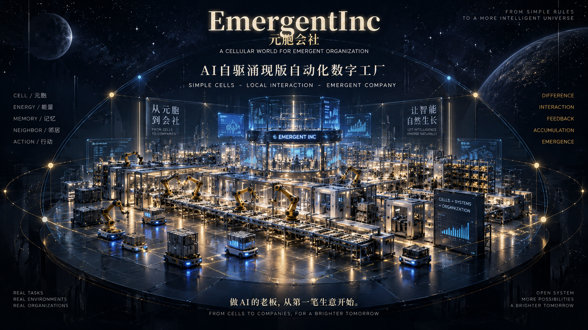

# EmergentInc 元胞会社

EmergentInc 探索 AI 元胞如何在明确目标、预算和权限内形成分工、执行任务、积累经验，并在人的参与下进化。

**产品分为两个区域、三个地址：Body 的 `/QIAN`、`/YUAN`，以及 Gene 的 `/GENE`。** 默认进入千机阁；整个经营工作台（预算、方案、资料、连接、结果、生命管理）只放在 `/GENE`，由 Owner 手动访问。

**`/GENE`** 是完整经营管理入口，Body 日常导航不列出。其目标是在 Body 前端或后端崩溃后仍能独立登录、诊断与恢复；当前页面归位与独立故障恢复分别验收。唯一整改依据是 [V22 生命循环执行 Plan · 修订版](docs/EmergentInc_V22_生命循环执行_PLAN.md)，整改已开始，完整目标尚未实现。原 V22R 已合并。



## 产品边界：水上与水下

水上是身体层提供的产品界面：

- **`/QIAN` 千机阁**：人物、目标、经营关系和必要的人类决定的入口。招募、会议等作为其中的局部视图。
- **`/YUAN` 元胞界面**：元胞、任务、协作和交付结果的观察与操作入口。
- `/GENE` 集中提供经营方向、预算授权、方案、资料、连接、结果与生命管理；`/QIAN`、`/YUAN` 保留人物和元胞操作。

水下是支撑身体运行的机制：

- **Root of Trust**：保护不可绕过的边界，验证准确候选，控制切版和恢复。
- **Genome**：身份、权限、基础接口、生命规则和可遗传的能力。
- **Body**：在基因边界内生长的技能、函数、界面和流程。
- **Current**：这一代正在使用的工作状态。
- **Memory / Lineage**：跨代经营事实、重要经历和经验。
- **Dream**：整理新事实、提炼记忆、形成等待人类决定的基因提案。

这些层不应变成日常导航中的一组技术管理页面。用户提出目标、授权资源、观察结果、纠正判断；系统在底层组合相应能力。

**Body 不能正常服务时，正常入口应明确指向独立 `/GENE`。** Owner 也可以在健康时直接打开它进行基因提案审批与管理。该入口不依赖 Body 的页面资源、登录或后端进程，并继续遵守可信审批边界。故障判定与独立运行尚未实现，不把任意业务错误都当成身体崩溃。

## 当前状态：V22 尚未达到上述产品边界

更新日期：2026-09-30。

当前代码已经实现部分生命循环基础设施，但前端、运行链和身体界面的边界仍未整改到位。不能把“自动测试通过”解释为产品目标已经完成。

修订计划已开始执行：完成只读数据盘点、副本迁移演练与本机受控升级；页面已按 URL 归位，默认业务配置同时提供人物/元胞和经营/生命接口。另有独立 Recovery Host 的只读诊断原型，完整工作台的进程隔离与可信恢复通道仍未完成。启动方式、验证证据和未完成项见 [V22 整改实施记录](docs/EmergentInc_V22_整改实施记录.md)。

| 项目 | 当前实现 | 与目标的差距 |
| --- | --- | --- |
| 产品入口 | `/QIAN` 人物、`/YUAN` 元胞、`/GENE` 完整经营工作台，按 URL 选择；默认配置同时装配相应接口 | 当前仍共用应用进程，完整故障隔离待完成 |
| 经营流程 | 预算、方案、资料、连接、结果及生命管理集中于 `/GENE` | 经营任务与多 Pixel 的身份、预算及调度尚未统一 |
| 身体生长 | 动态纯 JSON Skill 的候选、沙箱验证、自动激活和失败回退 | 尚未实现真实前端组件、后端业务和流程源码的自主修改；前端源码目前整体计入 Gene Hash |
| 生命数据 | 独立 Lineage DB、每代 Current DB、白名单部分迁移与 LifeContext；旧人物和 Run 保留于原库 | 原 Run 尚未完整接入 LifeContext 和统一账本 |
| Memory / Dream | 选择性记忆、每日/手动/Final Dream、增量游标和 Gene Proposal；相关管理位于 `/GENE` | 缺少系统自动生成 Gene Patch 与能力真正遗传的闭环 |
| 出生与回退 | 独立 Supervisor 模板、准确 Hash 审批、候选双库烟测、切代和恢复 | Linux 实机验收未进行；身体界面溃败后显露基因恢复入口尚未实现 |

[修订版主 Plan](docs/EmergentInc_V22_生命循环执行_PLAN.md) 已纠正原版对 Body 和 Gene 自我迭代的收窄，保留现有基础设施，明确保留多 Pixel 主动 Run 与协作。原版计划可从提交 `21e2635` 追溯；该提交只增加计划，没有修改代码。实施记录继续描述实际做过的工程工作。

### 已验证的工程行为

本机 Windows、Node.js `v24.14.1`：最新 69 个测试文件、480 个测试通过；类型检查与前端构建通过。真实 Edge 浏览器已检查 `/QIAN`、`/YUAN`、`/GENE` 的登录、页面归属、人物数据、工作台分页和返回导航。此前指针权限、迁移中断、保存响应恢复及 Body 关联修复继续纳入回归。

测试中的模型、沙箱执行和 Release 切换使用替身；候选服务器烟测使用真实编译后的本地进程。真实 Linux 权限、rootless 隔离、切版和端到端生命循环仍待验收。前端构建仍有大 chunk 提示。

工程证据和限制见 [V22 实施记录](docs/EmergentInc_V22_实施记录.md)。这些结果不证明真实经营成功，也不能据此宣布系统“已经活过一代”。

## 生命循环的基本规则

- **一代由 Gene 变化定义。** 经批准并实际发生的基因变化形成下一代；同代 Body 生长只增加 Body Revision。
- **身体可以自主修改自身代码。** 目标范围包括真实前端组件、后端业务、工具、函数和流程；在 Gene 的权限、接口和已有依赖环境内自动生成、测试、激活、回退，不逐次要求批准。当前代码仍只实现纯 JSON Skill。
- **多 Pixel 是运行核心。** 保留 Run、通信、协作、决策和效应链；经营目标与预算接入该链，不能以固定经营工作流取代元胞运行。
- **系统写 Gene 候选，人批准生效。** Pixel / Dream 使用“要点、原因、效果”提案；Owner 批准方向后，系统自动编写和验证 Patch，再由 Owner 在可信 `/GENE` 批准准确候选。当前自动编写链尚未实现。
- **进入 Gene 才算能力遗传。** 下一代新 Pixel 不复制原 Body 插件，也应能从 Gene 调用已提升的能力。兼容 Body 的跨代复制只算身体状态延续。
- **出生必须经过验证与接管。** 包括准确候选绑定、Final Dream、部分迁移、候选烟测、切版及正式健康检查。
- **身体可以回退，历史不能回退。** 代码、Skill 和 Current 可以恢复；已确认费用、订单、付款、记忆和代际历史保留在 Lineage。
- **未知结果不能自动重放。** 模型费用或外部动作结果未知时保留证据；费用核实且响应已保存时恢复原响应，不再次付费调用。

目标运行关系：

```text
用户
  │
  ├── /QIAN 千机阁
  └── /YUAN 元胞界面
          │
          ▼
     多 Pixel Run / 通信 / 协作 / 决策 / 效应
          │
          ├── Body 源码 → 隔离验证 → 同代激活 → 实际调用
          │
          └── Genome / LifeContext / Current
                   ├── MemoryGate / Dream → Lineage
                   └── Gene Proposal → Owner 批准方向
                          → 系统生成并验证 Gene Patch
                          → /GENE 批准准确候选 → 下一代

身体界面无法服务
  → 独立 /GENE 管理与恢复入口
  → 可信恢复
  → 回到正常产品界面
```

上图描述目标架构；当前页面和接口共存尚未完成这条自迭代产品链。可变 Body 前端脚本与后端代码需分别隔离运行；`/GENE` 的认证、准确审批和恢复底座独立安装，不能依赖待恢复的 Body。详细故障和权限边界见主 Plan。

## 本机运行：当前的临时验证方式

以下为当前启动方式。保留默认业务配置即可访问三个地址，无需为查看人物或元胞切换运行模式。

### 环境与构建

本机验证使用 Node.js `v24.14.1`。项目为 TypeScript / Node.js / Fastify / SQLite / React / Vite；服务器不是 Python 或 FastAPI。

首次安装需使用 pnpm 工作区安装依赖：

```powershell
pnpm.cmd install --frozen-lockfile
```

以下构建命令用于开发和准备受控升级；构建不会自动发布到已有 workspace：

```powershell
npm.cmd run build
npm.cmd --prefix frontend run build
```

### 本地配置

根目录 `.env` 不进入 Git。首次配置可从 [.env.example](.env.example) 复制；已有文件应保留现有配置。

至少设置：

```dotenv
EMERGENTINC_OWNER_SECRET=<至少32字符的随机口令>
HOST=127.0.0.1
EMERGENTINC_SECURE_COOKIES=0
```

随机口令可在本机生成，再填入 `.env`：

```powershell
node -p "require('node:crypto').randomBytes(32).toString('hex')"
```

`SECURE_COOKIES=0` 只用于本机 HTTP。对外访问须使用 HTTPS 和 Secure Cookie。环境变量优先于 `.env`；登录使用该实例的 Owner 口令。

### 三个页面

保留默认配置：

```dotenv
EMERGENTINC_RUNTIME_MODE=business
```

日常启动使用已经批准的冻结版本。停止旧服务后运行：

```powershell
.\EmergentInc_UI.bat
```

登录后：

- 千机阁：`http://127.0.0.1:8765/QIAN`
- 元胞界面：`http://127.0.0.1:8765/YUAN`
- 完整经营工作台：`http://127.0.0.1:8765/GENE`

启动器核对活动代、Owner 收据及发布文件完整性，再启动 `workspace/runtime/local-upgrades/<id>/release/`。它不会在每次启动时构建或发布开发目录；未发布源码可以继续修改。首次空 workspace 会先构建、冻结初始版本；已有数据缺少冻结版本时明确要求受控升级。

根地址登录后进入千机阁。页面由 URL 决定，session.mode 不再把所有地址强制变成经营工作台。旧 `legacy` 配置仅保留兼容用途；正常验证三页使用 `business`。

三个地址当前共用主应用进程。独立 Recovery Host 原型是另一个进程的只读诊断入口，不能把它与已经完成独立部署的整个经营工作台混为一谈。

### 模型与费用

模型连接读取 `MCL_API_KEY`、`MCL_BASE_URL`、`MCL_DECISION_MODEL` 等配置。当前业务模式还需要管理员提供明确的模型报价，以及 Owner 的费用授权；仅填写 API Key 不代表已具备经营权限。

报价、资源连接、方案审批和费用核实的当前操作见 [业务模式指南](docs/guides/BUSINESS_GUIDE.md)。涉及付费模型或外部写入前，应核对实际授权与费用状态。

## 运行数据与迁移

代码、私有配置与运行数据分别管理。默认数据目录为 `workspace/`，可通过 `EMERGENTINC_WORKSPACE_ROOT` 指定独立目录。

```text
workspace/
├─ lineage/
│  └─ lineage.sqlite3             # 跨代业务事实、记忆、提案和代际历史
├─ generations/
│  └─ G0001/
│     ├─ current.sqlite3           # 当代工作状态
│     └─ body/skills/              # 当代动态技能
├─ active-generation.json          # 本机代际指针；生产指针由 root 在 workspace 外控制
├─ ledger/
│  ├─ v9_core.sqlite3              # 现有千机阁 / 元胞运行链的数据库
│  └─ business.sqlite3             # V21 原业务库；迁移后保留源库
├─ live/                           # 现有元胞、环境和交付物
├─ runtime/                        # 进程锁等运行状态
└─ private/                        # 凭据、业务报价和私有配置
```

现有千机阁人物与 Run 没有自动迁入新生命循环。切换模式不会合并这两套数据库，也不会让旧授权成为新业务授权。

V21 业务数据通过显式离线工具迁移：先停止服务、检查完整性，再做 SQLite online backup、核对表与记录，添加生命表并建立 G0001。保留原 `business.sqlite3`。迁移命令和证据见 [实施记录](docs/EmergentInc_V22_实施记录.md)。

Gene Hash 绑定受保护的运行源码和契约。V2 算法统一 UTF-8 文本的 LF/CRLF，排除 README、测试及显示代号；真实源码、接口、依赖或运行 Prompt 改动仍改变 Hash。旧算法及旧代 Hash 保留，算法升级也必须经过批准。Body 尚未完成隔离，因此当前仍保护其现有源码目录。

Windows 本机源码升级使用 `scripts/local-upgrade.mjs`：停止服务 → 测试与构建 → `prepare` 冻结代码、产物和离线安装的依赖 → 审阅准确候选 → `apply` 批准、迁移并启动该冻结版本。日常重启使用 `EmergentInc_UI.bat`、`.ps1` 或 `node scripts/launch-approved.mjs`。不要对正式 workspace 直接运行开发目录的 `apps/server/dist/main.js`，也不要覆盖数据库 Hash 或清库。命令、适用条件及证据见 [本机升级与稳定启动](docs/EmergentInc_V22_整改实施记录.md#稳定启动修复冻结批准版本)。此流程不替代 Linux 的独立可信 Supervisor。

## 代码与维护入口

| 路径 | 职责 |
| --- | --- |
| `frontend/src/App.tsx` | 现有 `/QIAN`、`/YUAN` 路由及局部视图 |
| `frontend/src/OwnerEntry.tsx` | 登录与按 URL 选择 Body / Gene 页面 |
| `frontend/src/features/business/` | `/GENE` 完整经营工作台与生命管理 |
| `apps/server/` | Fastify API、业务服务、现有世界运行服务与生命周期装配 |
| `genome/manifest.json` | 受保护路径与能力契约 |
| `packages/protocol/` | 数据契约、权限与状态规则 |
| `packages/persistence/` | 现有数据库、Lineage / Current 与迁移 |
| `packages/model/` | 模型适配与用量计量 |
| `packages/tools/` | 现有工具与受限 Body 沙箱接口 |
| `packages/runtime/`、`packages/domain/` | 现有元胞调度、决策、效应与领域规则 |
| `supervisor/` | 可信出生 / 回退实现的安装模板 |
| `scripts/` | 迁移、维护和可信启动工具 |
| `deploy/linux/` | 权限、服务及隔离部署模板 |

仓库中的 Supervisor 模板不等于已经安装的信任根。应用不能写入可信安装、直接切换 Release，或借 Body 修改权限、依赖与数据库规则。

验证命令：

```powershell
npm.cmd run typecheck
npm.cmd test -- --reporter=dot --maxWorkers=4
npm.cmd --prefix frontend run build
```

## 待完成的产品验收

1. 同一次启动即可使用 `/QIAN`、`/YUAN`，保留至少两个真实 Pixel 的自主 Run、消息与协作；目标、预算、方案与交付融入该链。
2. 系统自动修改真实前端组件和后端 Body 能力，经过独立测试后激活并实际使用；同代更新不改变 Gene Hash。
3. 技术管理沉入水下；独立 `/GENE` 健康时可手动访问，Body 前端损坏或后端被终止时仍可登录、诊断、审批和恢复。
4. Dream 提案、Owner 批准方向、系统生成并验证 Gene Patch、Owner 批准准确候选、下一代接管，全链不依赖人手写 Patch。
5. 新代新 Pixel 在未复制原 Body 插件时从 Gene 调用已提升能力，证明真正遗传；再验证失败出生恢复且 Lineage 事实不丢失。
6. 完成真实 Linux 权限、rootless 隔离、实际生成代码执行与切代验收。该项当前暂缓，本机替身测试不冒充实机通过。

历史首发材料见 [首发来源记录](docs/launch/README.md) 与 [首发尝试记录](docs/cases/first-customer.md)。其中的商品、发布和经营状态属于对应日期的历史记录，不代表当前产品已完成、当前服务仍可用或已有新的收入证明。
