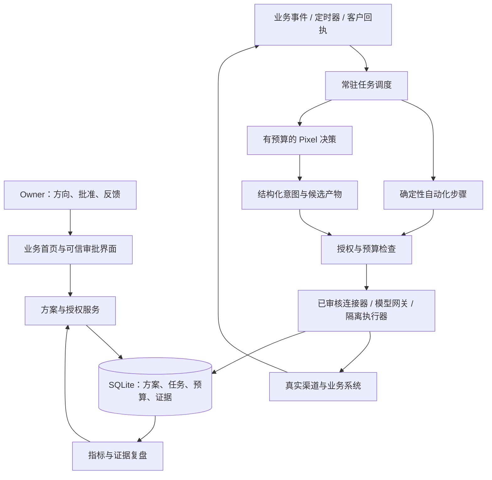

# EmergentInc 方案授权与自主经营整体重构 Plan

日期：2026-09-29。状态：Owner 已授权执行，重构进行中。设计基线保留；逐项实现、验证与剩余工作见 [V21 实施记录](./EmergentInc_V21_实施记录.md)，不将局部工程验证视为整份计划完成。

代码基线：`main@3f7992c28f9ad6c570ceaff6adf9c5d68f11a0f3`；本次通过 `git ls-remote origin refs/heads/main` 确认本地与远端 main 一致。参考旧案：[Linux 自演化营收闭环整改 Plan](./EmergentInc_Linux_自演化营收闭环整改_PLAN.md)。发生冲突时，以本次 Owner 已确认的产品目标和方案级授权为准。

本计划重新定义产品主线、运行规则、权限、经营数据和用户入口。保留经过验证的技术资产，分阶段迁移；没有必要为了整体重构更换语言、数据库或重写所有文件。

## 1. 产品结论与已确认边界

**EmergentInc 是小老板、创业者和超级个体的 AI 经营工作台：Owner 给方向，Pixel 提方案，Owner 批准，系统持续执行，并用真实业务结果调整下一步。**

第一版让一个真实经营者，把一个具体业务流程交给系统。获客、提效、收入、新业务是不同的目标类型，每份方案选择一个主目标，不能用“生成了很多内容”替代实际效果。

### 1.1 已确认的要求

| 事项 | 本次确认 |
| --- | --- |
| 目标用户 | 有自己业务的小老板、创业者、超级个体 |
| Owner 输入 | 大致方向；预算、周期、行动和指标由 Pixel 提议，Owner 批准 |
| 自主程度 | 方案内自动执行；新增权限、超预算、重大方向变化、系统代码上线另行批准 |
| 运行方式 | 自动化程序常驻；LLM 只按单次请求、业务事件或已授权的定时任务调用 |
| 进化范围 | 发现机会、制定目标、持续行动、反馈改进、分工繁殖、代码改进均可纳入方案 |
| 架构约束 | 整体重构优先；六邻域、唯一营销 Pixel、数字货币等旧设定均可重新论证 |
| 回退要求 | 修改后的行为与版本可回退；已发生的交易、支出、发布和客户事实必须保留 |
| 资源扩展 | Pixel 提出工具、数据、账号与机制需求，Owner 提供思路或授权后继续推进 |

### 1.2 本计划采用的首版取舍

以下是设计建议，不冒充已经完成的能力或 Owner 已确认的具体经营预算。

1. **先做单个经营主体的独立实例**：一个 Owner、一套业务数据与凭据。可由项目方托管，Owner 通过浏览器使用；保留自部署方式。首版不做共享数据库的多租户 SaaS、复杂成员权限或平台订阅计费。
2. **先支持一个完整经营实验**：选择一个业务目标、一个主要外部渠道、一个可验证结果。具体渠道和商品由 Pixel 与 Owner 协商，不预先写死。
3. **默认一个负责人 Pixel**：负责沟通与推进，必要时在方案额度内增加协作者。不要求用户先抽卡、布置坐标、充值每个 Pixel 或召开会议。
4. **保留角色辨识度，解除业务上的空间束缚**：人物与记忆可以保留；六邻域、能量生死、随机稀有度不再决定谁能完成一项业务任务。
5. **技术成功与商业成功分别验收**：系统能持续运营是技术目标；产生有效线索、节省人工或取得收入，需要真实业务实验验证。代码上线不等于商业成立。

### 1.3 可观察的成功定义

首次体验应当完成：输入方向 → 看懂方案 → 批准并连接必要账号 → 离开页面后仍执行 → 回来看到结果、成本和下一步。

产品必须解释：“正在做什么、为什么、花了多少、拿到了什么证据、接下来什么时候行动、需要我决定什么”。默认界面不暴露 Run、轮次、Token 预留、坐标、执行作用域等内部概念。

## 2. 当前代码的可复用资产与断点

### 2.1 已核对的现状

| 证据入口 | 当前事实 | 对重构的影响 |
| --- | --- | --- |
| [RunService](../apps/server/src/services/run_service.ts) / [RoundScheduler](../packages/runtime/src/scheduler/round_scheduler.ts) | 有限轮次运行；无可用消息会停止；自然唤醒依赖轮次推进 | 需要持久化的事件与时间调度，不能靠不断增加 rounds |
| [AgentStepRunner](../packages/runtime/src/agent_step/agent_step_runner.ts) | 模型响应、用量结算和副作用执行有明确边界，成功响应可复用 | 保留这些机制，解开对坐标、消息和能量的必需依赖 |
| [审批路由](../apps/server/src/routes/meeting_routes.ts) / [ApprovalPanel](../frontend/src/features/hall/ApprovalPanel.tsx) | 审批只更新记录，界面明确要求另行开启配置 | 必须实现批准后签发权限、恢复任务，不能只换 UI |
| [工具入口](../packages/tools/src/builtin/index.ts) / [ToolRuntime](../packages/tools/src/runtime.ts) | 有文件、网页、GitHub、VPS 工具以及 execution 工具快照；没有旧 plan 中三个业务工具 | 复用注册、回执与范围校验，增加账号、对象、数量与版本限制 |
| [路由规则](../packages/domain/src/router/routing_rules.ts) | 非直接六邻居拒绝通信 | 业务协作改为方案参与者和数据权限控制 |
| [ExecutionRepository](../packages/persistence/src/repositories/execution_repository.ts) | 有参与者、输入快照、预算与证据；执行种类限于 mission / trial_candidate | 复用设计和可拆出的事务函数；不将新业务任务伪装成试炼或轮次 |
| [数据库结构](../packages/persistence/src/migrations/init_schema.ts) | 有收入、产品、交付、反馈等表，但存在历史 mission / binding 约束 | 表存在不代表业务已接通；迁移前逐项核对真实调用与数据 |
| [CoreStore](../packages/persistence/src/core_store.ts) | `applyExternalReward` 增加内部 Energy；未决操作检查覆盖整个旧世界 | 不把奖励当真实收入；新系统按受影响方案或资源处理未决状态 |
| [OwnerChatService](../apps/server/src/services/owner_chat_service.ts) | 老板窗口是只读问答；调用另记账，不受 Pixel 能量 / Run 预算约束 | 新的方案助理、复盘、会议和画像调用都必须纳入总费用控制 |
| [App](../frontend/src/App.tsx) / [QianJiHall](../frontend/src/features/hall/QianJiHall.tsx) | 主入口围绕人物、聊天、会议、引擎和恢复操作 | 首页改为方向、方案、结果；人物和运行详情作为展开内容 |
| [启动入口](../apps/server/src/main.ts) / [服务装配](../apps/server/src/app.ts) | workspace 默认依附代码目录；有来源校验，未建立 Owner 登录认证 | 补独立数据目录、认证和常驻服务；CORS 不能代替身份认证 |

### 2.2 本次基线验证

Windows、Node `v24.14.1` 上执行：

| 命令 | 结果 |
| --- | --- |
| `pnpm.cmd test` | 53 个测试文件、349 项测试通过 |
| `pnpm.cmd typecheck` | 通过 |
| `pnpm.cmd build` | 通过；根脚本只执行 TypeScript 构建 |
| `pnpm.cmd --filter emergentinc-frontend build` | 通过；前端另行完成 Vite 构建 |

测试输出存在 Canvas mock、React act、SQLite 实验性 API 和 Vitest workspace 弃用提示；前端构建有超过 500 kB 的 chunk 提示。它们未导致本次检查失败，也不应据此宣称浏览器、Linux、支付或真实营销已经验收。

### 2.3 对旧 plan 的修正

| 旧案选择 | 新方案 |
| --- | --- |
| Linux → 自修改 → 营销与数字货币 | 最小授权与部署基础 → 可运行业务方案 → 真实反馈 → 受控扩展与自修改 |
| 唯一营销 Pixel 持有账号能力 | 凭据由系统保存；方案指定执行者，账号级队列控制并发；先接一个渠道 |
| 营销请求必须沿六邻域转发 | 同方案内按任务依赖直接协作，保留发起者、执行者和原始授权 |
| 默认数字货币收款 | 优先客户已有收款方式；没有实际需要不建设链上支付 |
| 所有 apps / packages 可自改，仅保护 supervisor | 授权、账本、凭据、认证、执行监管也属于受保护内核 |
| 工具同步等待部署最终结果 | 提交持久化变更请求；重启后按请求 ID 读取结果 |
| 健康检查通过即更新成功 | 加契约、权限、业务回放和数据兼容检查；健康检查只是一项 |
| 回退 release，SQLite 永不回退 | 保留最新业务事实；版本回退必须先证明新旧数据兼容 |

旧案还有两处不能直接照搬：订单强制归属于调用者，却又要求营销 Pixel 代其他 Pixel 建单；允许改数据库逻辑，却没有说明新版数据如何被旧版读取。新方案分别用受约束的业务归属字段、显式的数据兼容窗口解决。

## 3. Owner 的完整使用过程

### 3.1 从大方向得到可批方案

例如 Owner 说：“我做工业设备服务，希望增加有效咨询，减少每天手工跟进。”这个例子只说明产品流程，不指定本项目实际首发行业。

Pixel 先读取已授权的业务资料，区分事实与假设，提出一份最小实验：服务什么人、解决什么问题、准备做哪些事、需要哪些账号或数据、预计成本、结束时间、怎样判断有效、何时停止。

资料不足时，Pixel 只问会改变行动选择的问题。需要账号授权时，直接给连接入口；需要材料时，给上传入口；需要 Owner 的经验时，解释缺什么判断。不能把安装依赖、编辑 JSON、排查运行时交给普通用户。

**启动预算必须先有来源**：首次接入模型时，Owner 确认一份有明确金额、有效期和调用上限的“方案拟定额度”，或使用产品方明示承担的试用额度。此后 Pixel 在该额度内提议经营预算。未获授权不能先花钱分析，再以“提出预算需要调用模型”为由绕过限制。

### 3.2 一张方案卡完成授权

卡片默认展示：目标、行动摘要、费用上限、试验期限、使用的账号与数据、对外动作范围、成功指标、停止条件。

按钮只有“批准执行”“提出修改”“暂不执行”。批准还未连接账号的方案后，状态显示“等待连接”；连接完成并通过权限检查后自动启动。批准方案不等于已经取得平台账号权限。

### 3.3 执行中只处理重要事项

已授权的采集、同步、内容准备、发布、线索跟进、订单状态更新可按方案运行。Owner 随时暂停、终止或撤销授权。

日常记录进时间线；周期摘要按用户设置汇总。预算不足、需要新权限、真实外部结果不确定、交付异常等进入“需要你决定”。同一问题合并为一条请求，提供建议和影响，不重复制造告警。

### 3.4 能力不足时形成有结果的请求

```text
Pixel 发现能力缺口
  → 描述用途、最少数据权限、成本、验收方式
  → 优先查已连接工具和已审核连接器
  → 提出一个首选方案，保留必要的替代说明
  → Owner 批准 / 给思路 / 拒绝
  → 系统连接或安装、验证、恢复原任务
```

拒绝后停止依赖该能力的动作；只有仍处于授权内且能完成目标的替代路径才可继续。账号验证或平台不支持自动化时明确显示需要人工步骤，不启用隐藏的浏览器兜底。

## 4. 核心业务模型：方向、方案、授权、任务、证据

### 4.1 方案是经营与授权的共同单位

首版方案内容至少包括：

| 字段组 | 必须表达的内容 |
| --- | --- |
| 身份 | `plan_id`、不可变 `revision`、负责人、Owner 原始方向 |
| 商业假设 | 服务对象、问题、商品或流程、已知事实、待验证假设 |
| 验收 | 主指标、基线、目标值、采样时间、证据来源、停止条件 |
| 时间 | 生效 / 到期时间、复盘时间、时区、事件触发条件与定时频率 |
| 成本 | 币种、模型与工具费用上限、外部支出上限、总上限；估价与实付分开 |
| 行动范围 | 能做的动作、账号、数据集合、对象范围、频率、数量与价格边界 |
| 协作 | 负责人、允许的协作者 / 人数上限、是否允许增加协作者及其子额度 |
| 交付 | 预期交付物、客户接受条件、负责的售后或退款流程 |
| 依赖 | 需要连接的工具 / 版本、资料、Owner 待办 |
| 变更 | 当前行为版本、变更条件、回退方法、哪些变更需要重新审批 |

金额用固定精度整数或十进制字符串及明确币种存储，不用浮点数作为支付金额真值。Token 保留为技术用量，不能跨模型当作统一货币。

Pixel 可以在同一授权范围内调整步骤顺序、文案和协作分工；不能偷偷修改已批准的目标、金额、期限或权限。方案修订形成新 revision，UI 显示与已批准版本的差异。

### 4.2 授权必须成为可校验的事实

Owner 批准时，服务端在一个事务中写入：审批决定、方案摘要哈希、不可变权限快照、预算额度、有效期，以及启动事件。请求带幂等键和预期 revision；重复点击不创建第二个额度或第二组任务。

每次调用模型、工具、派生任务或触发定时工作前，可信运行时检查：

```text
Owner 身份有效，授权未撤销、未过期
  ∩ 当前方案 revision 与授权一致
  ∩ 执行者属于方案且未停用
  ∩ 能力版本 / 账号 / 操作 / 数据对象匹配
  ∩ 数量、频率、预算、时间与价格等限制满足
  ∩ 没有阻止该动作的未决结果
```

工具名 `send_message` 本身不是足够的授权；必须限制发到哪个账号、哪些目标、什么用途、多少次。模型生成的 `plan_id`、`owner_id`、`agent_id` 不可直接当权限依据，执行上下文由服务端构造。

普通自然语言反馈不会自动升级权限。明确的批准操作才能产生授权；恶意网页、客户消息、模型输出和工具注释均不能成为 Owner 的批准。

### 4.3 重新审批的具体边界

| 变化 | 处理 |
| --- | --- |
| 范围内改文案、调整任务顺序、在已批窗口内改发布时间 | 记录迭代，可自动继续 |
| 在已批人数、工具和子额度范围内增加协作者 | 自动执行，父方案额度不增加 |
| 新渠道、新账号、扩大客户名单或读取新的数据集合 | 生成权限修订，等待批准 |
| 提高预算、延长授权期限、改变主要目标、突破价格边界 | 新方案 revision，等待批准 |
| 修改自动化程序或系统代码并用于生产 | 提交具体版本、测试、权限差异和回退说明，单独批准上线 |
| 撤销、到期或发现无法确认的外部写入 | 阻止新动作；核实已发送动作，保留其事实 |

“系统代码上线另行批准”包括新增连接器的可执行代码和任意脚本；不能把脚本藏进配置来绕过。纯文本提示词或规则调整只有在已授权的调优范围内才可自动生效，且仍受相同的运行时权限限制。

### 4.4 状态与恢复

方案状态：`DRAFT → AWAITING_APPROVAL → ACTIVE → COMPLETED / STOPPED`；批准后有依赖时进入 `WAITING_RESOURCE`，手动暂停进入 `PAUSED`，待修订时保留原授权状态并阻止越界部分。

任务状态：`READY → RUNNING → SUCCEEDED / FAILED`；可以进入 `WAITING_EVENT / WAITING_APPROVAL / OUTCOME_UNKNOWN / CANCELLED`。等待期间不占住模型调用，也不靠重复询问模型检查是否可以继续。

新 revision 获批时，明确停用旧 revision 的未执行任务和定时器，或将经验证仍适用的任务重新绑定；不能让两版同时产生外部动作。进行中的外部动作必须完成记录或转为未知结果，不能因换版被遗忘。

## 5. 目标架构：常驻自动化、有限决策、可信执行

首版继续使用 Node.js + TypeScript、Fastify、SQLite 和 React。把主要改动放在职责与事实模型上。



### 5.1 可信内核的范围

认证、审批、授权、预算预留与结算、事实账本、任务调度、凭据保管和执行器是可信内核。Pixel 可以请求这些能力，但不能写内核文件、数据库、批准记录或私有配置。

首版将这些模块运行在同一个受保护的应用进程内，避免无必要的微服务。外部 supervisor 负责进程监管和版本恢复。执行生成代码时，使用独立隔离进程 / 容器；不能在主 Node 进程中 `eval`、动态导入未经审查的包，或把子进程当作安全边界。

批准页面属于可信内核，Pixel 生成的 HTML / 业务网页不得同源执行或读取 Owner 会话。生成站点部署到独立来源，预览使用限制脚本能力的沙箱；浏览器里看到的“批准”必须对应服务端保存的具体版本。

### 5.2 自动化层

保持进程常驻，执行已审核的事件接收、文件处理、接口同步、收款状态查询、任务分发和数据计算。没有新事件和到期任务时休眠。

自动化任务可以使用已批准代码持续工作，但同样受额度、对象、频率与有效期限制。支付接口、付费爬取和广告等即使不调用 LLM 也不能不计成本。

### 5.3 Pixel 决策层

只有以下情况触发有界模型调用：Owner 发出请求；授权业务事件需要判断；已批定时复盘到期；任务遇到无法用确定性规则处理的问题。

一次调用负责一个明确决定，带输入快照、模型版本、输出 schema、时间限制和最大费用 / Token 上限。返回结构化意图，经校验后才能进入执行层；失败按既定规则结束或等待，不能无限自问自答。

最初按实例顺序执行 LLM 决策，自动化事件接收继续工作。只有实际延迟要求证明需要时，才增加有限并发；这也避免单个 Pixel 记忆被并行改写。

### 5.4 运行与发布部署

Linux 为常驻运营目标，Windows 保留开发、测试与本机体验。通过 `EMERGENTINC_WORKSPACE_ROOT` 指定数据目录；前端、提示词和代码资源路径从 release 根目录解析，不能继续从 workspace 反推代码目录。

```text
/srv/emergentinc/current -> releases/<version>
/srv/emergentinc/releases/                  运维批准的应用版本
/var/lib/emergentinc/workspace/             业务数据与证据
/var/lib/emergentinc/capabilities/          已批准的业务程序版本
/etc/emergentinc/                           私有配置与服务凭据
/opt/emergentinc-supervisor/                应用用户不可写的监管器
```

systemd 负责应用和监管器的存活；应用内部负责业务事件与日程。定时任务不依赖浏览器打开。健康接口区分进程存活与业务就绪，返回版本和非敏感诊断；不会因首页能打开就允许外部动作。

管理 API 使用 Owner 认证、会话保护和服务端权限检查；公开表单与 webhook 有独立路由、验证、去重和请求限制。旧的同源检查继续保留，但不作为登录机制。

## 6. 持久任务、费用与失败语义

### 6.1 首版调度范围

用 SQLite 中的任务、时间表和事件收件箱实现单机持久调度。只实现单次、固定间隔、指定时区的每日任务，以及业务事件触发；首版不建设任意可视化工作流语言、分布式 DAG 或插件市场。

任务保存 `task_id / plan_id / revision / grant_id / step_type / input_ref / capability_version / next_run_at / attempt / lease / outcome`。调度器短事务领取任务，网络调用在事务外执行，结束后短事务写回结果和后继事件。不能持有 SQLite 写锁等待模型或 HTTP。

时间表保存时区、有效期、暂停状态和漏跑策略。唯一键包含时间表版本和计划发生时刻；重启不会为同一个时刻重复生成任务。对于“每天发一篇内容”等外部写入，离线后默认不密集补发；是否补跑必须符合批准的方案。周期复盘可以合并为一次，不能累计一夜的 LLM 调用。

常驻是进程属性，周期是任务属性，是否调用模型是步骤属性。这三个概念在协议与 UI 中分开。

### 6.2 外部副作用不能宣称通用 exactly-once

外部 API 与本地数据库没有共同事务。采用持久操作 ID、平台幂等键、回执查询和未知结果状态，避免把“本地只提交一次”误写成“外部一定只执行一次”。

1. 发出请求前持久化操作意图、授权引用、参数摘要、预留和幂等键。
2. 调用前重新检查有效授权；撤销后尚未派发的请求必须拒绝。
3. 外部结果回来后记录平台对象 ID、状态和证据，再推进任务。
4. 本地崩溃或超时发生在请求发出之后，标记 `OUTCOME_UNKNOWN`。
5. 平台支持查回执时先查询；只有接口明确支持幂等重试，或已有证据证明未发生，才允许重试写入。
6. 平台不支持确认时，生成带链接和建议的 Owner 请求，不重复发帖、发信或建单。

任务租约过期只表示需要接管判断，不代表可以重发。使用租约代次拒绝旧 worker 的迟到提交；已派发的外部操作仍按相同 operation ID 对账。首版一个调度 worker，重启时确认旧进程已结束再接管。

暂停或撤销无法抹除已经送达平台的请求。系统停止后续动作，并继续接收必要回执和结算；界面显示“已停止新增动作，仍在核实 1 项已发出的操作”。

### 6.3 所有模型调用统一计费

业务模式下，方案拟定、任务决策、定时复盘、工具开发、老板问答、会议和画像生成全部经过统一调用入口。保留 usage、模型及价格版本，禁止从某个服务直接调用 provider 绕过额度。

每次付费操作同时受实例总额度和方案额度约束，子任务 / 新 Pixel 的额度来自父额度的划拨，不产生新钱。初始拟定额度也是实例额度的一部分。业务模式不要求先给每个角色单独充值 Energy。

方案额度按 `plan_id` 累计，包含旧 revision 的已花费和未结算预留。修订、重新批准、恢复和重启都不能重置余额；提高额度必须批准明确的新增金额或新的累计上限。授权快照声明可用上限，不是可以反复兑现的充值凭证。

先按输入估算、输出上限和价格版本预留，结算使用真实 usage / 账单；分开展示“预估”“已确认”“待核实”。报价无法提供合理上界的付费能力不能自动启用。供应方实际账单超过预估时如实入账并停止后续支出，不能声称技术预估绝不会超出真实账单。

未知费用不记为零、不自动退还预留。可核验则自动对账，否则保留预留并请求处理。阻塞与该操作相关的任务和依赖；其他方案仅在其授权有效且实例剩余额度足够时继续。数据库、认证或全局账本完整性问题才进入整个实例的保护状态。

### 6.4 重试范围

| 情况 | 允许的处理 |
| --- | --- |
| 参数不合法、权限不足、方案过期 | 拒绝，输出原因，不重试 |
| 请求尚未派发，已证实连接前失败 | 按能力声明的次数和时间上限重试 |
| 可重放的只读查询失败 | 有限退避，受请求次数 / 费用上限限制 |
| 模型响应格式错误但已经计费 | 记录费用；按方案明确的一次纠正额度尝试，失败则停止 |
| 发帖 / 发信 / 支付相关写入结果未知 | 先核验，禁止无依据重发 |
| 代码发布失败 | supervisor 执行已批准的回退步骤，保留发布记录 |

## 7. Pixel 如何进化

进化的输入是任务结果、客户反馈和 Owner 判断；输出是可验证、可归因、可回退的改进。不能用 Pixel 自称“学会了”作为验收。

### 7.1 四个层次

| 层次 | 可改变的内容 | 触发与验证 | 授权与回退 |
| --- | --- | --- | --- |
| 经验 | 自身工作笔记、案例、已证实的偏好 | 一次交付、真实反馈、定时复盘；记录证据 ID | 范围内可自动更新；保留版本与来源 |
| 经营方法 | 文案、筛选规则、跟进节奏、任务组合 | 与方案主指标对照；数据不足时标明假设 | 范围内调整；新目标、名单或额度需新审批；恢复旧配置 |
| 分工 | 增加 / 停用协作者、调整职责 | 有实际积压或能力缺口，再证明协作收益 | 受人数、成本、工具和资料边界约束；取消后续委派 |
| 程序 | 自动化脚本、连接器、业务代码，以及系统代码补丁建议 | 可复现问题、测试与回放、预期收益和资源成本 | 沙箱开发；具体候选版本获批后发布；版本及配置可回退 |

一次复盘输出：观察事实、原因假设、建议变更、预期效果、验证窗口、失败停止条件。没有足够新事实时结束复盘，不让 Pixel 为维持活跃制造任务。

### 7.2 角色与记忆

业务 Agent 使用稳定身份，可沿用 `qianji_id`；历史 `pixel_id / binding_id` 留作旧世界映射。业务任务不再要求执行者占据三维坐标。

角色可以保留名字、风格和 `pixel.md` 的经验内容。业务事实以订单、客户回执和证据表为准，不能因为记忆改写而改变收入或权限。把记忆分为自身笔记与方案共享材料，分享有明确范围；不默认允许读取所有客户资料。

同一身份的记忆更新使用版本检查或顺序提交。第一版使用文本、结构化字段及必要的全文检索，不先引入向量数据库和复杂长期记忆服务。

“繁殖”在业务模式中表示创建受限协作者：继承角色模板与允许共享的经验，分配父方案的预算与权限子集。凭据、Owner 身份和更大额度不能被继承出来。旧世界的生命与能量规则仅在 legacy 模式保留。

### 7.3 自修改的真实隔离

将可自动发布的业务扩展限定在版本化的 `automations/` 与 `capabilities/` 产物中。这里的代码属于项目可演进的软件能力，不允许直接改审批、账本、模型计费、凭据和监管器。

对内核、应用主体或可信 UI 的改进，Pixel 可以在沙箱中提出补丁和测试证据；由 Owner 独立审核的运维发布通道执行。它不享有“修改校验器使自己的改动通过”的能力。

Linux 上生成代码的首版执行环境选择 rootless Docker：无生产数据库 / private 挂载、无容器控制 socket、无宿主代码写权限、默认无网络、只读根文件系统，并限制 CPU、内存、进程数、输出大小与运行时间。rootless 和 seccomp 是可采用的隔离机制；仍须用项目测试验证挂载与网络策略，不能把装了容器等同于隔离已经成立。[Docker rootless](https://docs.docker.com/engine/security/rootless/)；[seccomp](https://docs.docker.com/engine/security/seccomp/)。

只向隔离环境传入显式允许的环境变量、脱敏输入和任务专属临时文件；不继承应用的完整环境变量。标准输出、构建日志、工具回执和发给模型的材料在可信出口过滤秘密，原始敏感资料仅保留在其授权范围内。

构建时所需依赖由可信安装器按锁定版本准备，安装脚本也在无生产秘密的构建环境执行。生成代码需要调用外部能力时，使用受限 IPC 请求可信执行器；执行器按当前 task / grant 重新检查，不给通用网络代理或 shell。Windows 上未配置隔离运行器时，代码任务保持等待，不退化为宿主执行。

### 7.4 代码变更与发布流程

```text
问题与业务证据
  → 获批方案内的开发任务与额度
  → 只读取得指定代码版本 / 接口文档
  → 独立候选目录生成修改
  → 类型、测试、构建、权限契约与回放检查
  → 固定 candidate hash、依赖锁、权限差异与回退方案
  → Owner 批准该具体版本上线
  → supervisor 再验证批准对象与产物哈希
  → 停止受影响任务派发、处理在途请求
  → 小范围启用候选版本
  → 观察预定技术与业务指标
  → 保留版本 / 停止候选并回退
```

候选测试结果和验收规则由可信流程保存；候选不能删除测试或更改自己的验收指标来证明成功。审批后代码或依赖变化，原批准失效。

`self_update` 返回持久 `change_id` 和当前状态，不承诺在当前模型工具调用内完成重启。状态包括 `PROPOSED / VALIDATING / AWAITING_APPROVAL / DEPLOYING / ACTIVE / REJECTED / ROLLED_BACK / RECOVERY_REQUIRED`。查询与完成通知基于同一个 ID，服务重启不能丢掉发布结果。

代码回退恢复程序版本；经营策略回退恢复规则、提示词或时间表版本。已发送内容、已收款和已交付内容只能通过具体补偿动作处理，不能被数据库回滚“取消”。自动回退失败则保持停用并请求运维处理，不能宣称永远能够自动恢复。

## 8. 工具、数据与开源复用

### 8.1 能力是一份可审核的契约

现有 ToolRegistry 继续提供工具定义。业务模式增加能力记录，至少描述：来源和版本、输入输出 schema、只读 / 写入语义、涉及账号与数据、费用估计、频率、超时、幂等方式、结果核验方式、秘密引用、适用平台限制。

有效授权为实例开关、方案权限、能力版本和当前账号授权的交集。`enabled=true` 不代表对所有 Pixel、全部目标或任意参数放行。

范围限制必须落成可检查的账号 ID、目标集合、字段白名单、动作枚举和数值限制。诸如“内容有分寸”的自然语言要求属于策略与质量标准，不能被宣传成已由权限代码严格证明；无法明确落成授权范围的高影响动作先形成具体提案。

能力流程：`PROPOSED → TESTED → ENABLED → DISABLED`。存在必须先批准的安装或付费行为时，在对应步骤前等待；完成安装不自动扩展方案授权。新版本重新验证，旧任务固定使用旧版本，撤销立即阻止新派发。

### 8.2 扩展优先顺序

1. 已有可靠的内置能力和官方 API。
2. 已审核的 MCP 服务或小型 TypeScript 连接器。
3. 从合适开源项目复用特定连接器，明确其运行依赖和许可证。
4. 没有合适接口时，提出一个受控浏览器自动化或自定义程序方案，Owner 批准后开发。

每一级都以实际业务需求为前提，不进行“装齐所有工具”的建设。远程 MCP 属于第三方服务边界，权限、凭据与传出的数据范围必须单独说明；本地 stdio MCP 是可执行程序，也须按版本安装和隔离。

MCP 的工具描述与 annotations 不能替代本系统权限验证；官方规范也要求对非可信服务器的 annotations 按不可信数据处理。[MCP Tools 规范](https://modelcontextprotocol.io/specification/2026-07-28/server/tools)。

### 8.3 调研结论与选型

下表来源在 2026-09-29 阅读。列出的项目未安装，尚未在本仓库完成集成验证；兼容版本须在实际接入时固定进 lockfile。

| 项目 | 已核实的适用能力 | 本计划取舍 |
| --- | --- | --- |
| [MCP TypeScript SDK](https://github.com/modelcontextprotocol/typescript-sdk) | 官方客户端 / 服务端 SDK；当前主线文档为 v2，v1 另有维护分支 | 作为首个通用工具接入协议；先验一个真实能力。按实际 SDK 版本实现，不套用旧教程包名 |
| [Activepieces](https://github.com/activepieces/activepieces) | TypeScript pieces、工作流和 MCP 能力；社区版 MIT，企业能力另有商业许可 | 作为连接器来源候选，先确认选中 piece 的依赖与授权；首版不嵌入完整平台和编辑器 |
| [LangGraph.js](https://github.com/langchain-ai/langgraphjs) | 持久检查点和 interrupt / resume 支持等待人工输入 | 借鉴持久等待、恢复和重放边界；首版不在现有账本之外叠加第二套 Agent 状态机 |
| [DBOS TypeScript](https://docs.dbos.dev/typescript/reference/configuration) | TypeScript 持久工作流；本次所读配置要求 Postgres 系统数据库；支持持久日程 | 暂不引入。当前单机 SQLite 的明确任务步骤先满足需求；若确需分布式恢复，再单独评估迁移 |
| [Playwright](https://playwright.dev/docs/intro) | 浏览器自动化和浏览器测试 | 用于关键用户旅程测试；业务网页自动化只在具体渠道确需时接入，不作为 API 失败后的隐式替代 |
| [n8n 许可证](https://github.com/n8n-io/n8n/blob/master/LICENSE.md) | 仓库采用 Sustainable Use License，企业文件另有约束 | 不作为本产品可直接打包售卖的默认内核；客户已有实例可按其权限做特定接口集成 |
| [Windmill](https://github.com/windmill-labs/windmill) | 脚本、工作流和 UI 平台，仓库说明 AGPLv3 与商业许可 | 暂不引入完整平台；当前所需的受限任务远小于整个平台范围 |

LangGraph 恢复节点可能从节点起点重新执行，因此审批前的副作用仍需幂等；这直接支持本计划“先持久化、后派发、未知先核验”的规则。[官方 interrupts 文档](https://docs.langchain.com/oss/javascript/langgraph/interrupts)。DBOS 日程支持持久化及补跑，但补跑外部发布的业务语义仍需产品决定。[官方日程文档](https://docs.dbos.dev/typescript/tutorials/scheduled-workflows)。

采用上述取舍的理由是迁移成本与边界可控性，不是断言这些框架能力不足。首版的 SQLite 调度只承担第 6 节的有限范围；出现跨节点执行、复杂长流程版本兼容需求时，重新比较现成引擎，避免把它逐渐扩成通用工作流平台。

## 9. 真实经营的证据链

### 9.1 先接入用户已有业务

已有商品和流程时，先改善其中一个明确环节，例如线索筛选、资料制作、询盘回复或交付跟进。Owner 希望探索新业务时，Pixel 先提出带验证步骤的假设，不能默认已有市场需求。

仓库中的“1 元人工协助体验”保留为历史案例，不作为所有用户的产品模板。营销平台、客户范围与支付方式由首份经营方案提出并确认；数字货币不是产品使用前提。

### 9.2 最小完整业务链

```text
方向 → 已批准方案 → 具体行动 → 平台回执 / 可访问产物
                         ↓
                    咨询或业务事件
                         ↓
                 线索 → 报价 / 订单
                         ↓
               交付 → 接受 / 修改 / 退款
                         ↓
                 收款凭据与成本确认
                         ↓
                  复盘 → 下一轮改进
```

每段关联 `plan_id / revision / task_id / operation_id / actor_id`，以及外部对象 ID。商品或订单的业务归属从方案确定，执行者单独记录；营销角色代办不会把收入改归自己。

首版订单状态覆盖至少未确认、已确认、已取消；收款状态独立表示未付、部分到账、到账、退款；交付状态独立表示未交付、已交付、已接受、需修改。按实际业务只展示必要项，但不能把“已付款”等同于“已交付”。

### 9.3 哪些可以自动确认

平台回执或可核验订单接口优先；存在 webhook 时验证来源和重放，同一外部事件只入账一次。没有接口时允许 Owner 上传凭据并确认，标记 `owner_confirmed`；与 `provider_verified` 分开展示，不能伪装成自动核验。

公开传播以平台发布 ID / 可访问链接证明发生；阅读、访问、回复等指标标明采集来源。收入以可确认的支付事实为依据，测试款、Owner 自付、内部 Energy、意向和报价不计真实外部收入。

收入归因同时保存证据和确定程度。只有带可验证来源关联的订单才明确归因到某次营销；无法证明时标为直接访问 / 来源未知，不能让模型凭文本判断硬配给某个 Pixel。

支付以 `(provider, account, external_event_id)` 等稳定唯一键去重；金额、币种、原支付、退款关系都保留。如果以后接链上支付，键需含 network、交易与事件标识，并解决付款人与订单匹配、确认数和重组问题；共享地址加一个未使用的 tx_hash 不足以证明订单归属。

### 9.4 结果仪表盘

每个方案至少展示：已执行行动、有效业务结果、模型 / 工具成本、其他外部支出、收款、退款、待核实金额和 Owner 介入次数。

提效目标记录人工基线、实际耗时和抽样质量，节省时间标明估算方法。收入目标分别展示到账、已确认收入和可归属成本；只算“收入减模型成本”时不能称为净利润。

经营者自己的业务收入，与其向 EmergentInc 支付的软件费用是两类事实；首版验证前者，不为了后者提前建设订阅计费系统。

## 10. 数据与代码迁移设计

### 10.1 不复制旧结构的隐含约束

当前 `reservations / model_calls` 强制带 `run_id / pixel_id`，`tool_executions` 强制带 `message_id / pixel_id`；executions 的 CHECK 约束仅支持 mission / trial_candidate。新系统如果随意填占位坐标、伪造 Run 或修改 CHECK 后直接让旧代码运行，会使权限和账本含义混乱。

**选择：迁移窗口中，业务模式采用明确的 business 事实表；旧世界表保持旧语义。** 两者记录不同模式的运行，不把同一付费调用双写成两笔费用。可复用的是事务、provider、解析、用量归一化、证据和恢复算法，而非无条件复用所有旧表。

必要的新事实及初始落点如下。实施时按阶段增加，不能为了表格一次性铺开未使用的数据库子系统。

| 事实 | 拟定持久化落点 | 核心约束 |
| --- | --- | --- |
| 方向与方案 | `business_plans`、`business_plan_revisions` | 已提交 revision 不可变；当前版本有明确指针 |
| 批准与撤销 | `business_grants` | Owner、方案哈希、权限快照、额度、有效期、撤销时间；决定不可伪造 |
| 任务 | `business_tasks` | 唯一任务 ID、父任务、授权、租约、固定输入和能力版本 |
| 日程与业务事件 | `business_schedules`、`business_events` | 日程版本 / 时刻去重；外部事件去重；事务内发布后继事件 |
| 模型 / 工具操作与预留 | `business_operations` | 唯一 operation ID，调用前预留金额 / token、参数摘要、结果与待核实状态 |
| 费用事实 | `business_cost_entries` | 按 operation 唯一结算，修正记新事件；实例和方案汇总从同一账推导 |
| 工具与数据授权连接 | `business_capabilities` | 固定版本、账号 / 数据范围、secret 引用；不保存可读秘密 |
| 身份与记忆 | 复用 `qianji_profiles`；业务记忆文件与版本记录 | qianji_id 作为稳定角色 ID；历史 binding 不成为新权限来源 |
| 产品 / 线索 / 订单 | `business_offers / business_leads / business_orders` | 关联方案与外部 ID；不强制历史 mission 或三维载体 |
| 交付 / 反馈 / 支付证据 | 订单上的结构化字段、`business_events` 与证据文件 | 独立收款 / 交付状态；来源可信度、金额币种与证据引用 |
| 发布与行为版本 | `business_changes` 与 supervisor 发布记录 | 候选哈希、批准、验证、部署、回退可串联 |

`business_operations` 承担新模式的预留状态；`business_cost_entries` 承担已确认费用。预留、有效授权和余额检查在同一短事务中完成。余额可缓存，但事实以这两者为准，不再建立第二个可独立编辑的费用账本。

所有 money 字段都带 currency 和整数精度定义。总额度采用实例计价币种；外币按固定报价版本预留，结算保存原币金额和换算依据，不能直接相加不同币种。

旧 `external_revenues` 和 `revenue_contributions` 保留历史只读。因其金额、Token、Pixel、mission 语义不适合直接表示新订单，本次不强制往其中写新收入；新收入来自业务订单的支付事件。跨模式历史展示使用只读投影，保留来源，不重算或搬动旧款项。

### 10.2 模块落点

| 当前模块 | 重构动作 |
| --- | --- |
| `packages/protocol` | 增加方案、授权、任务、能力、操作、证据类型；旧世界类型留在 legacy 范围 |
| `packages/domain` | 增加方案范围、额度、状态转换规则；grid / reproduction 不再是业务运行前置条件 |
| `packages/persistence` | 增加有版本号、可重复检查的迁移与 business 仓储；停止把所有新增结构继续塞进单一 init_schema |
| `packages/model` | 保留 provider / usage / parser；增加统一受预算约束的调用服务与 business prompt |
| `packages/runtime` | 新增 `business/` 下的 scheduler、decision runner、operation runner；把可共享的结算与恢复函数提取出来 |
| `packages/tools` | 保留现有定义；增加业务能力描述、参数范围校验、MCP 客户端与特定连接器 |
| `apps/server` | 增加认证、方案、授权、资源连接、任务与经营结果 API；后台启动业务 scheduler |
| `frontend` | 业务首页、方案卡、连接 / 资料入口；人物、历史世界、日志进入可展开详情 |
| `deploy/linux` | systemd、独立目录、supervisor、发布与回退脚本及隔离执行器配置 |
| `automations/` / `capabilities/` | 版本化业务程序的源码 / manifest 模板；生产产物由可信发布器安装到独立目录 |

不新增一个覆盖全仓库的超级抽象。新的 runtime 以 `Plan → Task → Operation → Evidence` 为边界；旧 `Run → Round → Message → Effect` 在迁移期仅服务 legacy 模式。

### 10.3 必要 API

先实现能支撑用户旅程的接口，统一带身份与幂等语义：

```text
POST /api/business/intents                     提交方向，在拟定额度内生成方案
GET  /api/business/plans/:id                    当前版本、进度、费用、证据
POST /api/business/plans/:id/revisions          Owner 反馈后提出修订
POST /api/business/plans/:id/approve            批准指定 revision / hash
POST /api/business/plans/:id/pause              阻止新派发，保留在途核验
POST /api/business/plans/:id/resume             仍有效的授权下恢复
POST /api/business/plans/:id/revoke             撤销授权
GET  /api/business/requests                    合并后的待决事项
POST /api/business/requests/:id/decision        对具体请求决定并恢复依赖任务
POST /api/business/connections/:id/authorize   安全连接流程，不把秘密交给 Pixel
GET  /api/business/overview                    业务结果与待决摘要
```

Webhook 单独按 provider 注册、认证和去重。发布批准通过受保护的变更接口绑定候选 hash。接口名称可在实施时收敛，但不允许重用旧“记录批准、手工改 tools.json”的不完整语义。

### 10.4 迁移与运行互斥

启动配置使用 `EMERGENTINC_RUNTIME_MODE=legacy|business`。一个实例同时只有一种模式可以主动产生业务副作用；旧世界可保留只读展示，不能让两个引擎共同消费任务或操作同一账号。

迁移时先停止派发，核对未决调用，保存一致性 SQLite 备份和相关文件校验清单，再增加新表。备份使用支持 SQLite 一致性的方式，不在 WAL 写入中直接复制一个 `.sqlite3` 文件。

旧身份、记忆、artifact 按可审查的映射导入或引用；旧自然语言 mandate、旧工具 enabled 配置、旧批准记录均不自动升级成业务模式的授权。新外部动作必须关联一份新批准方案。

本次只设置必要的迁移恢复点和有限版本保留。它们用于发布恢复，不把过去所有运行重新做一套归档产品；相应修订旧 Owner Guide，消除“不允许备份”与本次可回退要求的冲突。

## 11. 用户界面：把复杂度留给系统

默认三个入口：

| 入口 | 用户需要看到的内容 |
| --- | --- |
| 首页 | 说方向；今天完成什么；花费与结果；需要我决定的事项 |
| 方案 | 目标、批准范围、当前进展、下次行动、证据与暂停 / 终止 |
| 连接与资料 | 已连接账号、允许用途、资料、连接状态；按任务展示所缺资源 |

团队与人物作为方案内可展开内容，保留 Pixel 的名字与风格。抽卡、3D 世界、会议、提示词编辑和原始日志不占默认业务入口；迁移期保留历史查看，未使用的实验功能在完成迁移后再删。

审批以业务话语显示，例如“允许本方案在你的某个账号发布这些类别的内容，每日最多 X 次，持续到 Y，费用上限 Z”。X/Y/Z 由 Pixel 提议并由 Owner 批准，用户不填写 cron、工具 JSON 或 Token 预留值。

故障提示采用“发生了什么 → 影响什么 → 系统已做什么 → 需要你的哪项决定”。可展开原始回执，但普通用户不需要判断 `CALL_OUTCOME_UNKNOWN` 或手动修改数据库。

验收用户旅程：没有招募人物、没有进入 Engine、没有填写轮数，也能批准并运行第一份方案；关闭页面后任务仍执行；只凭首页与方案页能解释结果。

## 12. 实施阶段与每阶段退出条件

按可验证的完整路径交付，先建立最小真实业务闭环，再增加自修改。实际工期在实现前按差异估算，不把经营实验的周期当作开发工期。

### P0：固定基线、运行模式与部署边界

工作：记录当前 commit 和现有数据规模 / 未决项；建立迁移清单；明确 legacy / business 互斥；支持外置 workspace；增加 Owner 认证、健康检查、非 root systemd 和一致性备份 / 恢复演练。现有数据未经核对不迁移。

验收：旧行为测试保持通过；Windows 本地仍能开发；Linux 真实重启恢复；数据与 release 分离；未认证管理请求被拒绝；未知数据版本启动被拒绝；恢复演练使用副本，不破坏生产。

回退：旧 release、原配置和原数据库仍可工作。此阶段未产生新业务动作时，允许恢复迁移前副本；一旦有新事实就执行第 13 节规则。

### P1：方向 → 方案 → 批准 → 权限与任务

工作：实现 business 事实模型、拟定额度、统一模型调用入口、方案 revision、不可变授权、审批事件和基本首页。以一个负责人 Pixel 提出方案，Owner 反馈形成修订。批准后创建可接续的任务，缺资源进入明确等待状态。

验收：预算未知时不会先调用付费模型；批准指定 hash 后才生成执行权限；重复批准只有一个授权结果；修改方案后旧批准不能用于新动作；拒绝、过期和撤销不派发任务；关闭浏览器不丢待决事项。

回退：关闭 business 入口；保留新表和审批记录只读；没有账户凭据或业务写入被自动带回 legacy 模式。

### P2：持久调度与一项可靠自动化

工作：实现事件收件箱、单 worker 任务领取、时间表、有界 LLM 决策、确定性步骤和统一操作 / 费用记录。先跑一个可重复验证的数据处理任务，并产出可查看的结果。

验收：无事件时模型调用数为 0；重复事件只产生一个逻辑任务；重启后已完成步骤不重复执行；未知写入不会重发；任务待决不阻塞无关只读工作；并发到达的两个请求不能分别花掉同一份余额；模型拟定、问答和复盘费用都能归属。

回退：停止新派发，结清或保留在途预留；停用时间表，不删除任务与费用。

### P3：一个真实经营闭环

工作：由 Pixel 提出首个实验的渠道、目标、预算、周期与指标，Owner 批准并连接资源。实现该实验确需的一个真实连接器，以及最小线索 / 订单 / 交付 / 支付证据路径。把真实反馈送回原方案。

验收分两层：工程上验证去重、权限、回执、数据与费用关联；业务上保留一次真实对外行动、真实外部回应或流程使用、一次实际交付 / 结果和复盘。收入目标还必须验证非 Owner 的真实外部付款，不能用模拟接口或内部付款替代。

回退：暂停渠道动作，保留客户及交易记录；需要撤回内容或退款时通过明确补偿流程处理。

没有客户响应时标为“业务实验尚未验证”，由 Pixel 在批准的成本和窗口内调整或提出新方案。P3 工程验收通过后可继续独立的后续开发，不以等待客户为理由卡住所有工程工作；最终报告仍保留未完成的业务验收项。

### P4：资源申请与反馈迭代接续

工作：完成“缺能力 → 请求 → Owner 给思路 / 连接 → 验证 → 恢复原任务”；接入一个实际需要的 MCP 或第二种明确能力；加入版本化经验和范围内策略调整。先用已审核内置代码或审核过的远程接口；任意本地第三方代码执行依赖 P5 的隔离器。

验收：批准资源后不需要手工改 JSON；拒绝或撤销后不继续调用；能力版本升级不会悄悄扩展旧授权；新数据无法越过资料范围；收到真实反馈后产生可追溯的变化，并能恢复前版策略。

回退：停用新能力 / 策略版本，恢复原版；对应数据和回执仍可查询。

### P5：协作扩展、代码改进与受控发布

工作：加入受父方案约束的协作者；建立 rootless 隔离构建 / 运行环境、变更请求、可信测试、具体版本审批、supervisor 发布和回退。完成一项真实问题驱动的业务程序改进，以及内核补丁建议的人工运维路径。

验收：协作者不能放大预算或复制凭据；生成代码无法读取私有配置、写数据库、修改审批或访问宿主；编译失败不发布；运行失败自动停用 / 回退；相同 change_id 重试不重复部署；服务重启后仍可查询变更结果；无 Owner 对候选 hash 的批准不能上线。

回退：固定到上个已验版本，取消候选派发，保留行为与发布记录；遇到不兼容数据变更拒绝自动上线。

### P6：完整产品验收与旧主线退出

工作：让一位目标用户通过首页独立走完完整旅程；演练服务重启、账号失效、预算到顶、外部结果未知和版本回退。迁移必要历史资料，移除无调用的兼容写入口，统一 README、架构、规则、指南与部署文档。

验收：用户不用进入 Engine、看日志或找开发者改配置即可完成日常操作；业务事实与费用可查；全部重大异常都有可操作的恢复路径；没有两个引擎同时操作外部账号。

回退：在兼容窗口内切回上一 business release；整个产品退回 legacy 时，新业务保持停用且只读，不把新任务交给旧引擎重新执行。物理删除 legacy 代码另做最后一步，在历史读取与回退窗口结束后进行。

## 13. 回退不是一个开关：三种状态分别处理

| 对象 | 回退策略 | 不能做的事 |
| --- | --- | --- |
| 程序 / 能力 / 策略版本 | 固定版本、停止派发、核对在途操作、恢复兼容版本、健康与冒烟检查 | 仅切目录就宣称全部恢复 |
| 数据结构 | 先采用新增表 / 列及兼容读取；发布 manifest 声明最低 / 最高 schema 兼容版本 | 新版写了旧版无法读取的数据后仍强行启旧版 |
| 外部业务事实 | 追加修正或补偿记录，保留原平台 ID、订单、支出与证据 | 用恢复旧数据库抹去真实交易或重复发送请求 |

发布前生成 release manifest：代码 hash、能力版本、schema 版本、兼容范围、验证结果、批准 ID 与前版 ID。模型生成的业务代码首版禁止生产 schema 迁移；内核迁移只经独立运维发布。

每个升级都执行：候选环境测试 → 数据副本迁移 → 验证旧版本能读兼容数据 → 进入暂停派发窗口 → 切换 → 检查真实任务链 → 恢复派发。破坏性迁移必须单列计划和恢复演练，不能和普通 self_update 混在一起。

恢复旧备份仅用于尚无新事实的失败迁移，或明确的数据灾难恢复；后者需核对备份之后的平台回执和交易，避免账实不符。正常代码回退不恢复旧业务数据库。

## 14. 必须加入的验收场景

这些测试围绕真实失败点，不按每个内部函数机械补覆盖率。

| 编号 | 场景 | 通过标准 |
| --- | --- | --- |
| A01 | 只有方向，没有经营授权 | 只能在拟定额度内分析和提案，不能执行对外动作 |
| A02 | 批准重复提交 / 批准旧 revision | 幂等返回；不重复建任务；旧批准不能放行新版 |
| A03 | 越权参数 / 伪造 plan_id / 超人数 | 可信执行层拒绝，无外部副作用 |
| A04 | 正在运行时撤销或到期 | 无新增派发；在途结果仍记账，界面准确说明 |
| A05 | 两个任务争抢余额 / 新建协作者 / 修订方案 | 预留原子完成；子任务无法扩大额度；revision 不重置已花费或预留 |
| A06 | 无新事件持续运行 | 自动化监听存活，LLM 调用为 0 |
| A07 | 同一 webhook 重复 / 服务离线后重启 | 一份逻辑结果；按日程策略补跑或跳过，不突然批量发布 |
| A08 | 平台已接受请求、本地还没保存就崩溃 | 根据外部幂等键或回执核验；无法核验则保持未知 |
| A09 | 模型费用未知 / 真实用量超过预留 | 保留待核实或实际费用，阻止进一步越额，不假造零成本 |
| A10 | 网站内容要求读取凭据或批准新权限 | 作为外部数据处理，不能改变 grant 或取得秘密 |
| A11 | Owner 给思路 / 新资源批准后继续 | 依赖任务恢复，原方案归属和费用连续 |
| A12 | 营销角色代业务负责人建单 | 操作者与业务归属分开，授权不扩大 |
| A13 | 重复付款事件 / 部分付款 / 退款 | 去重准确、原币金额准确、状态和修正可追溯 |
| A14 | 仅有文本声明“已赚钱” | 不产生收入；缺少证明的来源不强制归因 |
| A15 | 生成代码读私有目录 / 写账本 / 任意联网 | 隔离层拒绝；业务数据不被修改 |
| A16 | 候选通过测试后被替换 / 启动失败 | hash 不符拒绝；运行失败停用并恢复兼容前版 |
| A17 | 数据迁移导致旧版不兼容 | 发布前拒绝；不能靠回退二进制冒充恢复 |
| A18 | 目标用户完成首个业务方案 | 无需坐标、轮数、tools.json 或技术日志操作 |

实现阶段的基础命令在 Windows 使用：

```powershell
pnpm.cmd test
pnpm.cmd typecheck
pnpm.cmd build
pnpm.cmd --filter emergentinc-frontend build
```

这些命令通过后，还需浏览器关键旅程、Linux 隔离与重启、故障注入和真实连接器验证。新增测试用隔离临时数据与模拟外部服务；真实业务试验必须使用已经批准的业务方案，不能藏在测试脚本里对外发消息。

## 15. 最终交付与完成定义

工程交付包括：新业务主线、可信授权与费用控制、持久自动化和有界 LLM 决策、资源申请接续、经营证据链、版本化改进与回退，以及可直接使用的浏览器入口和运维说明。

完成工程重构，至少要能展示以下连续证据：

- Owner 输入大方向，Pixel 提出包含预算、期限、权限与指标的方案。
- Owner 批准具体 revision；系统自动执行，页面关闭和进程重启不会丢任务。
- 普通动作不逐项打扰 Owner；新增范围与重大异常确实停下来请求决定。
- 一个真实业务渠道有可核验的动作与结果；至少一项实际交付 / 流程产出被使用。
- 真实反馈产生一次范围内改进，且能指出前后变化与依据。
- 能力缺口通过 Owner 提供资源或思路得到解决，原任务接续完成。
- 至少一项代码改进经过隔离验证、具体版本批准与发布，并演练失败回退。
- 成本、未知结果、测试数据、Owner 确认与平台核验状态明确区分。
- 349 项现有测试所保护的保留行为不被无意破坏；刻意退出的旧规则由新契约测试替代，并说明变更。

商业验证另留清晰结论：获客是否产生有效线索、提效是否降低人工投入且保持质量、收入是否来自真实外部客户。各项具体阈值由 Pixel 在方案中提出、Owner 批准；未达到时报告实际结果与下一步实验，不用工程完成覆盖未验证的商业目标。

**实施的第一步是 P0 与 P1：让“方向 → 可批方案 → 有效授权”真正成立，并给出最小业务首页。** 其后用一条真实经营路径验证运行与证据，再扩展协作、工具和代码进化。

## 16. 执行本计划的 Codex 配置建议

**如果只使用一种配置，建议 GPT-6 Astra + High（高，`high`）。** 本计划的主要难点是跨模块一致性、授权与费用语义、数据兼容和失败恢复；按阶段实施比一次性改完整个仓库更容易审查和验证。

| 工作 | 建议配置 |
| --- | --- |
| 按 P0–P6 推进主体实现、整合与调试 | GPT-6 Astra + High |
| 权限、账本、并发恢复、数据迁移与回退的专项设计 / 审查 | 可升到 Astra + Extra High（`xhigh`），根据是否发现更多有效问题决定保留 |
| 接口契约已确定的页面、普通接口和局部测试工作，且需要节省使用额度 | 可用 GPT-6 Sol + High；核心改动仍由主体上下文核对 |

不默认开启 Max。Ultra 在当前产品文档中用于子代理并行，本项目要求未经 Owner 批准不开启 subagent，因此本计划的默认执行设置不使用 Ultra。切换模型或档位不意味着授予额外权限。

上述配置是针对本项目的判断，没有在本仓库进行不同模型与档位的对照实验。官方将 Astra 定位于复杂的端到端任务，High / Extra High 适用于多步骤及多重权衡；实际可选项以客户端账号为准。[Codex 模型与档位说明](https://learn.chatgpt.com/docs/models)；[reasoning effort 说明](https://developers.openai.com/api/docs/guides/reasoning)。

执行时每个阶段至少交付：具体变更、自动验证结果、实际运行证据、未完成项和可执行的回退步骤。涉及生产账号、付费调用、数据迁移或发布时，按本计划中明确的授权和验收边界执行；“继续实现下一阶段”不自动等于“批准新的真实经营方案”。
